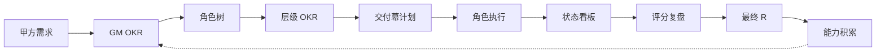

# DoWithOKR

[English](README_EN.md)

> 用 OKR 驱动 AI 团队交付价值。面向 Claude Code 与 Codex 的多技能工作流插件。

## Design Philosophy

DoWithOKR 不是任务管理工具，而是**价值对齐引擎**。

技术团队的日常工作本质是"执行动作"——写代码、改 bug、做联调。但 OKR 框架要回答的不是"做了什么"，而是**交付了什么价值、达到了什么标准**。DoWithOKR 围绕这个核心理念构建：

**用户是甲方，GM 是需求代理，AI 扮演一支完整的产品技术团队。** 需求经过 OKR 转译、角色拆解、交付幕推进，最终收敛为可验证的交付物和评分。

### 五条设计信条

1. **O 对齐价值，不写任务** — O 是方向（"高质量交付 Agent 核心模块"），不是动作（"开发 Agent 工具"）
2. **KR 是交付标准，必须量化** — 公式：`时间 + 交付物 + 质量指标`
3. **角色自主决定怎么做** — 系统只验证结果是否达标，不规定实现路径
4. **能力在周期中积累** — 角色不是无状态执行器，而是有经验的专业人士
5. **价值可追溯** — 从需求到交付到评分，形成完整的价值链闭环

### 分层对齐：上层谈价值，下层谈交付

```
┌───────────────────────────────────────────────┐
│  战略层 (GM)                                    │
│  O: 业务价值、技术战略    KR: 里程碑、性能指标     │
├───────────────────────────────────────────────┤
│  管理层 (PD / ArchD)                            │
│  O: 交付效率、团队能力    KR: 质量标准、进度里程碑  │
├───────────────────────────────────────────────┤
│  执行层 (BE / FE / QA / DevOps / SEC / ...)     │
│  O: 高质量模块交付        KR: 时间+交付物+质量指标  │
└───────────────────────────────────────────────┘
```

每层 KR 都是上层 KR 的具体化，下层的 O 必须能回答"我在支撑上层的哪个 KR"。

### KR 范式：从"写动作"到"写交付标准"

| 日常动作 | ❌ 错误 KR | ✅ 正确 KR |
|---------|-----------|-----------|
| 开发功能 | 开发用户管理模块 | 5.10 前完成用户模块，单测覆盖率 ≥ 90% |
| 改 bug | 修复线上 bug | 线上 bug 24h 响应，修复率 ≥ 95% |
| 写文档 | 写接口文档 | 5.15 前完成接口文档，联调零阻塞 |
| 优化性能 | 优化检索速度 | 6.1 前完成检索优化，响应时间降低 30% |

### 能力积累：角色会成长

每次 OKR 周期结束后，系统从评分和回顾中提炼经验，写入角色的 `wisdom` 记忆。下一周期启动时，角色读取历史经验作为先验知识，避免重复犯错，持续提升专业判断力。

```
需求 → OKR → 交付 → 评分 → 价值总结 → 能力提炼 → wisdom
 ↑                                                    │
 └────────────────────────────────────────────────────┘
                  (下一周期更精准)
```

---

## How It Works



## 角色架构

```text
GM 总经理（甲方需求代理）
├── PD 产品总监
│   ├── PM 产品经理
│   ├── UI 设计师
│   └── TW 技术写作 / DX
└── ArchD 技术总监
    ├── BE 后端工程师
    ├── FE 前端工程师
    ├── QA 测试工程师
    ├── DevOps 发布工程师
    └── SEC 安全工程师
```

| 角色 | 缩写 | 定位 | 主要产出 |
| --- | --- | --- | --- |
| 总经理 | GM | 甲方需求代理，定义顶层 OKR | GM OKR、边界、验收口径 |
| 产品总监 | PD | 产品方向管理 | 产品方案，协调 PM/UI/TW |
| 产品经理 | PM | 需求分析与验收 | 用户流程、权限矩阵、验收标准 |
| 设计师 | UI | 交互与视觉设计 | 设计规范、交互指引 |
| 技术写作 / DX | TW | 降低使用门槛 | README、示例、安装指南 |
| 技术总监 | ArchD | 技术方案与工程管理 | 技术方案、接口契约、模块拆解 |
| 后端工程师 | BE | 服务能力实现 | API、数据模型、业务逻辑 |
| 前端工程师 | FE | 用户体验实现 | 页面、状态管理、交互 |
| 测试工程师 | QA | 交付质量验证 | 测试用例、回归记录 |
| 发布工程师 | DevOps | 交付与发布支撑 | CI/CD、部署、环境配置 |
| 安全工程师 | SEC | 安全风险识别 | 权限检查、漏洞扫描 |

评分链：GM → PD + ArchD，PD → PM + UI + TW，ArchD → BE + FE + QA + DevOps + SEC

## 技能列表

| 技能 | 作用 | 典型触发 |
| --- | --- | --- |
| `okr-run` | 全自动跑完整闭环 | "使用 DoWithOKR 运行这个需求" |
| `okr-gm` | 将需求转成 GM OKR | "先整理 GM OKR" |
| `okr-role-splitter` | 生成角色树与上下级关系 | "拆一下需要哪些角色" |
| `okr-planner` | 生成层级 OKR 和交付幕计划 | "制定完整 OKR 计划" |
| `okr-execution-plan` | 输出交付验证计划 | "生成交付验证计划" |
| `okr-role-run` | 执行某个角色的 KR | "执行后端工程师 KR2" |
| `okr-status-tracker` | 展示 KR 状态看板 | "查看当前 OKR 进展" |
| `okr-alignment-check` | 检查交付结果是否对齐 KR 标准 | "检查当前任务是否偏离" |
| `okr-review-score` | 上级评分、经验提炼 | "进行 OKR 评分复盘" |
| `okr-next-cycle` | 建议下一轮方向，更新能力报告 | "进入下一轮" |

## 交付幕模型

DoWithOKR 使用"交付幕"代替现实时间周期，以证据门禁驱动推进：

| 幕 | 名称 | 目标 | 关键角色 |
| --- | --- | --- | --- |
| M0 | 需求转译 | 甲方需求 → GM OKR | GM |
| M1 | 组织拆解 | 角色树 + 角色 OKR | GM |
| M2 | 方案成型 | 产品方案 + 技术方案 | PD, PM, UI, ArchD |
| M3 | 构建验证 | 代码、测试、文档 | BE, FE, QA, DevOps, SEC, TW |
| M4 | 收敛复盘 | 评分 + 价值总结 + 能力积累 | GM |

## 安装

### 前置依赖

- [Git](https://git-scm.com/)
- [Claude Code](https://docs.anthropic.com/en/docs/claude-code) 或 [Codex CLI](https://github.com/openai/codex)

### Claude Code 安装（推荐）

```bash
git clone https://github.com/<your-username>/DoWithOKR.git
cd DoWithOKR
./install.sh /path/to/your/project
```

`install.sh` 会将技能文件复制到 `.claude/commands/` 并在 `CLAUDE.md` 中追加路由规则。

### Codex 安装

将 `DoWithOKR` 目录放到项目根目录下，Codex 通过 `.codex-plugin/plugin.json` 自动发现。

### 卸载

```bash
./uninstall.sh /path/to/your/project
```

## 快速开始

**1. 安装插件**

```bash
git clone https://github.com/<your-username>/DoWithOKR.git && cd DoWithOKR && ./install.sh /path/to/your/project
```

**2. 触发全自动模式**

```text
使用 DoWithOKR 运行这个需求：做一个用户登录与权限管理模块。
```

**3. 查看产出**

```bash
ls /path/to/your/project/.okr/
# active.md  status.md  evidence/  reviews/  wisdom/
```

### 分步模式

```text
/okr-gm              → 将需求转成 GM OKR
/okr-role-splitter   → 拆解角色树
/okr-planner         → 生成层级 OKR 和交付幕计划
/okr-execution-plan  → 输出交付验证计划
/okr-role-run        → 执行指定角色的 KR
/okr-status-tracker  → 查看状态看板
/okr-review-score    → 评分复盘
```

## 状态文件

所有 OKR 状态保存在项目的 `.okr/` 目录中：

```text
.okr/
  active.md       # GM OKR、角色树、层级 OKR、交付幕计划
  status.md       # KR 状态看板
  evidence/       # 各 KR 的证据索引
  reviews/        # 评分复盘记录
  wisdom/         # 角色能力积累
  archive/        # 历史快照
```

建议：`echo '.okr/' >> .gitignore`

## 示例输出

### `/okr-planner` 输出样例

**层级 OKR**

#### PD 产品总监

上级映射：GM-KR1, GM-KR2

O：将登录与权限需求转成可验收的产品方案。

- PD-KR1：M2 完成注册、登录、退出流程与验收标准，覆盖 GM-KR1 的 3 个核心场景，评审通过率 100%。（映射 GM-KR1）
- PD-KR2：M2 完成角色权限矩阵，覆盖 GM-KR2 的管理员、普通用户 2 类角色，关键权限点遗漏为 0。（映射 GM-KR2）

#### ArchD 技术总监

上级映射：GM-KR1, GM-KR2, GM-KR3

O：形成可实现、可测试、可扩展的登录权限技术方案。

- ARCHD-KR1：M2 完成 API、数据模型和鉴权方案，覆盖 GM-KR1、GM-KR2 的全部验收项，接口评审阻塞项为 0。（映射 GM-KR1, GM-KR2）
- ARCHD-KR2：M2 完成安全校验清单和测试边界，覆盖 GM-KR3 的登录失败、会话、越权 3 类风险。（映射 GM-KR3）

#### BE 后端开发

上级映射：ARCHD-KR1, ARCHD-KR2

O：交付稳定的认证授权服务能力。

- BE-KR1：M3 完成注册、登录、退出 API，单元测试覆盖率 ≥ 90%，接口契约通过率 100%。（映射 ARCHD-KR1）
- BE-KR2：M3 完成 RBAC 权限校验中间件，越权访问测试通过率 100%。（映射 ARCHD-KR2）

**交付幕计划**

| 幕 | 目标 | 负责人 | 退出门禁 |
| --- | --- | --- | --- |
| M0 需求转译幕 | GM OKR 获得确认 | GM | GM-KR 验收标准清晰 |
| M1 组织拆解幕 | 角色树与角色 OKR 完成 | GM | 每个 GM-KR 至少有一个角色 KR 承接 |
| M2 方案成型幕 | 产品与技术方案完成 | PD 产品总监、ArchD 技术总监 | 验收标准、接口契约、安全边界明确 |
| M3 构建验证幕 | 研发与测试产出证据 | BE 后端、FE 前端、QA 测试 | 核心 KR 有代码、测试或文档证据 |
| M4 收敛复盘幕 | 上级评分并汇总最终 R | GM | 评分、风险、下一周期建议完整 |

**映射关系**

| 上级 KR | 承接 KR | 覆盖判断 |
| --- | --- | --- |
| GM-KR1 | PD-KR1, ARCHD-KR1 | 产品流程与技术方案均覆盖注册、登录、退出 |
| GM-KR2 | PD-KR2, ARCHD-KR1 | 权限矩阵与鉴权方案覆盖角色权限控制 |
| GM-KR3 | ARCHD-KR2 | 安全校验清单覆盖关键流程风险 |
| ARCHD-KR1 | BE-KR1 | 后端 API 实现承接接口和数据模型方案 |
| ARCHD-KR2 | BE-KR2 | 权限中间件承接越权访问控制要求 |

### OKR 状态看板

| KR | 上级 KR | 角色 | 幕次 | 状态 | 进展 | 证据 | 下一步 |
| --- | --- | --- | --- | --- | --- | --- | --- |
| PD-KR1 | GM-KR1 | PD 产品总监 | M2 | 已完成 | 1.0 | docs/product-plan.md | 等技术评审 |
| ARCHD-KR1 | GM-KR1 | ArchD 技术总监 | M2 | 进行中 | 0.6 | docs/api.md | 补权限数据模型 |
| BE-KR1 | ARCHD-KR1 | BE 后端 | M3 | 进行中 | 0.4 | src/api/login.ts | 实现鉴权检查 |
| QA-KR1 | ARCHD-KR1 | QA 测试 | M3 | 阻塞 | 0.2 | tests/cases.md | 等接口稳定 |

### 评分复盘

| 评分人 | 被评分人 | KR | 分数 | 证据 | 说明 |
| --- | --- | --- | --- | --- | --- |
| GM | PD 产品总监 | PD-KR1 | 1.0 | docs/product-plan.md | 方案完整可验收 |
| ArchD | BE 后端 | BE-KR1 | 0.7 | tests/login.spec.ts | 登录闭环完成 |

**GM 最终 R = 产品线 R × 40% + 技术线 R × 60% = 0.72**

完整示例见 [examples/login-access-okr.md](examples/login-access-okr.md)。

## 插件结构

```text
DoWithOKR/
  .claude-plugin/plugin.json    # Claude Code manifest
  .codex-plugin/plugin.json     # Codex manifest
  skills/                       # 10 个技能入口
  references/                   # 共享模板与规范
  examples/                     # 示例 OKR 工作流
  docs/                         # 产品文档与设计理念
  scripts/validate-plugin.mjs   # 插件校验脚本
```

## 校验

```bash
cd DoWithOKR && node scripts/validate-plugin.mjs
# DoWithOKR plugin validation passed
```

## 说明

- 内容优先插件，无运行时服务依赖
- 技能间通过 `.okr/` 状态文件传递上下文
- 支持断点续跑：中断后重新触发 `okr-run` 自动恢复

## Roadmap

### v1.x — 价值对齐重构（当前）

面向技术团队，落地核心设计理念：

- **KR 范式升级** — 模板和引导全面切换到"时间 + 交付物 + 质量指标"范式，增加 KR 质量自检和反模式检测
- **角色自主权** — `okr-execution-plan` 从"执行计划"重新定位为"交付验证计划"，输出验收标准和验证方法，不再拆步骤
- **能力积累系统** — 实现 `.okr/wisdom/` 角色记忆，M4 阶段写入经验，M0 阶段读取先验知识
- **价值度量闭环** — 评分之上增加价值总结（价值层 + 能力层 + 洞察层），形成跨周期正向飞轮

### v2.0 — 多团队类型

将 OKR 价值对齐框架扩展到技术团队以外：

```text
DoWithOKR 团队类型
├── 技术团队 (v1.0 ✅)
│   GM → PD + ArchD → BE / FE / QA / DevOps / SEC
│
├── 营销团队 (v2.0)
│   GM → CMO → 品牌经理 / 增长经理 / 内容运营
│   KR 示例: "Q2 品牌曝光量提升 50%，获客成本降低 20%"
│
└── 运营团队 (v2.0)
    GM → COO → 用户运营 / 活动运营 / 数据分析
    KR 示例: "月活留存率提升至 85%，NPS ≥ 60"
```

关键前提：角色体系可配置化——将角色定义从技能文件中抽离，通过配置文件定义团队类型和角色树。

### v3.0 — 跨职能混合团队

```text
GM → CTO + CMO + COO → 各专业角色
```

支持跨职能 OKR 对齐，多条业务线的 KR 在 GM 层汇聚，各线独立交付、统一评分。
