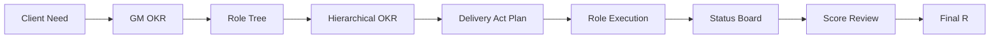

# DoWithOKR

[简体中文](README.md)

> Turn natural language requirements into executable, trackable, scorable OKR workflows. A multi-skill plugin for Claude Code and Codex.

## How It Works

DoWithOKR's core metaphor: the user is the client, GM (General Manager) is the requirement proxy, and AI plays a full product-engineering team. Requirements flow through OKR translation, role decomposition, delivery acts, and converge into verifiable deliverables with scores.



## Role Architecture

```text
GM General Manager (Client Proxy)
├── PD Product Director
│   ├── PM Product Manager
│   ├── UI Designer
│   └── TW Technical Writer / DX
└── ArchD Technical Director
    ├── BE Backend Engineer
    ├── FE Frontend Engineer
    ├── QA QA Engineer
    ├── DevOps Release Engineer
    └── SEC Security Engineer
```

| Role | Abbr | Positioning | Key Output |
| --- | --- | --- | --- |
| General Manager | GM | Requirement proxy, defines top-level OKR | GM OKR, boundaries, acceptance criteria |
| Product Director | PD | Product direction management | Product plan, coordinates PM/UI/TW |
| Product Manager | PM | Requirement analysis & acceptance | User flows, permission matrix, acceptance criteria |
| UI Designer | UI | Interaction & visual design | Design specs, interaction guidelines |
| Technical Writer / DX | TW | Reduces adoption friction | README, examples, setup guides |
| Technical Director | ArchD | Technical plan & engineering management | Tech plan, API contracts, module decomposition |
| Backend Engineer | BE | Service implementation | APIs, data models, business logic |
| Frontend Engineer | FE | User experience implementation | Pages, state management, interactions |
| QA Engineer | QA | Delivery quality verification | Test cases, regression records |
| Release Engineer | DevOps | Delivery & release support | CI/CD, deployment, environment config |
| Security Engineer | SEC | Security risk identification | Permission checks, vulnerability scanning |

Scoring chain: GM → PD + ArchD, PD → PM + UI + TW, ArchD → BE + FE + QA + DevOps + SEC

## Skills

| Skill | Purpose | Trigger |
| --- | --- | --- |
| `okr-run` | Full automated loop | "Use DoWithOKR to run this requirement" |
| `okr-gm` | Convert need to GM OKR | "Prepare the GM OKR first" |
| `okr-role-splitter` | Build role tree | "Split the required roles" |
| `okr-planner` | Hierarchical OKR + delivery acts | "Create the full OKR plan" |
| `okr-execution-plan` | Task-level execution plan | "Generate the execution plan" |
| `okr-role-run` | Execute a specific role's KR | "Run backend engineer KR2" |
| `okr-status-tracker` | KR status board | "Show current OKR progress" |
| `okr-alignment-check` | Task alignment check | "Check whether this task has drifted" |
| `okr-review-score` | Upper-level score review | "Run OKR score review" |
| `okr-next-cycle` | Next cycle recommendation | "Move to the next cycle" |

## Delivery Act Model

DoWithOKR replaces real-world time periods with "delivery acts", driven by evidence gates:

| Act | Name | Goal | Key Roles |
| --- | --- | --- | --- |
| M0 | Need Translation | Client need → GM OKR | GM |
| M1 | Organization Decomposition | Role tree + role OKR | GM |
| M2 | Solution Formation | Product plan + tech plan | PD, PM, UI, ArchD |
| M3 | Build Verification | Code, tests, docs | BE, FE, QA, DevOps, SEC, TW |
| M4 | Review Convergence | Scoring + final R | GM |

## Installation

### Prerequisites

- [Git](https://git-scm.com/)
- [Claude Code](https://docs.anthropic.com/en/docs/claude-code) or [Codex CLI](https://github.com/openai/codex)

### Claude Code (Recommended)

```bash
git clone https://github.com/<your-username>/DoWithOKR.git
cd DoWithOKR
./install.sh /path/to/your/project
```

`install.sh` copies skill files to `.claude/commands/` and appends routing rules to `CLAUDE.md`.

### Codex

Place the `DoWithOKR` directory in your project root. Codex auto-discovers it via `.codex-plugin/plugin.json`.

### Uninstall

```bash
./uninstall.sh /path/to/your/project
```

## Quick Start

```bash
# 1. Install
git clone https://github.com/<your-username>/DoWithOKR.git && cd DoWithOKR && ./install.sh /path/to/your/project

# 2. Trigger full auto mode (in Claude Code):
# "Use DoWithOKR to run this requirement: build a user login and access-control module."

# 3. Check output
ls /path/to/your/project/.okr/
# active.md  status.md  evidence/  reviews/
```

### Step-by-Step Mode

```text
/okr-gm              → Convert need to GM OKR
/okr-role-splitter   → Decompose role tree
/okr-planner         → Hierarchical OKR + delivery acts
/okr-execution-plan  → Task-level execution plan
/okr-role-run        → Execute a specific role's KR
/okr-status-tracker  → View status board
/okr-review-score    → Score review
```

## State Files

All OKR state is persisted in the `.okr/` directory:

```text
.okr/
  active.md       # GM OKR, role tree, hierarchical OKR, delivery act plan
  status.md       # KR status board
  evidence/       # Per-KR evidence index
  reviews/        # Score review records
  archive/        # Historical snapshots
```

Recommended: `echo '.okr/' >> .gitignore`

## Example Output

### Status Board

| KR | Upper KR | Role | Act | Status | Progress | Evidence | Next Step |
| --- | --- | --- | --- | --- | --- | --- | --- |
| PD-KR1 | GM-KR1 | PD Product Director | M2 | Done | 1.0 | docs/product-plan.md | Await tech review |
| ARCHD-KR1 | GM-KR1 | ArchD Tech Director | M2 | In Progress | 0.6 | docs/api.md | Add permission data model |
| BE-KR1 | ARCHD-KR1 | BE Backend | M3 | In Progress | 0.4 | src/api/login.ts | Implement auth check |
| QA-KR1 | ARCHD-KR1 | QA Engineer | M3 | Blocked | 0.2 | tests/cases.md | Waiting for stable API |

### Score Review

| Reviewer | Reviewee | KR | Score | Evidence | Note |
| --- | --- | --- | --- | --- | --- |
| GM | PD Product Director | PD-KR1 | 1.0 | docs/product-plan.md | Plan is complete and acceptable |
| ArchD | BE Backend | BE-KR1 | 0.7 | tests/login.spec.ts | Login loop complete |

**GM Final R = Product Line R x 40% + Tech Line R x 60% = 0.72**

See the full example in [examples/login-access-okr.md](examples/login-access-okr.md).

## Plugin Structure

```text
DoWithOKR/
  .claude-plugin/plugin.json    # Claude Code manifest
  .codex-plugin/plugin.json     # Codex manifest
  skills/                       # 10 skill entry points
  references/                   # Shared templates & specs
  examples/                     # Sample OKR workflows
  docs/                         # Product docs & specs
  scripts/validate-plugin.mjs   # Plugin validation script
```

## Validation

```bash
cd DoWithOKR && node scripts/validate-plugin.mjs
# DoWithOKR plugin validation passed
```

## Notes

- Content-first plugin with no runtime service dependency
- Skills communicate via `.okr/` state files for cross-invocation context
- Supports resume from checkpoint: re-trigger `okr-run` after interruption to auto-resume


