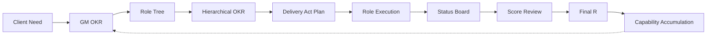

# DoWithOKR

[简体中文](README.md)

> Drive value delivery through OKR-powered AI teams. A multi-skill workflow plugin for Claude Code and Codex.

## Design Philosophy

DoWithOKR is not a task management tool — it is a **value alignment engine**.

The daily work of engineering teams is fundamentally about "executing actions" — writing code, fixing bugs, running integrations. But the OKR framework asks a different question: not "what did you do?" but **what value did you deliver, and to what standard?** DoWithOKR is built around this core insight.

**The user is the client, GM is the requirement proxy, and AI plays a full product-engineering team.** Requirements flow through OKR translation, role decomposition, delivery acts, and converge into verifiable deliverables with scores.

### Five Design Tenets

1. **Objectives align to value, never to tasks** — O is a direction ("deliver high-quality Agent core module"), not an action ("develop Agent tools")
2. **KRs are delivery standards, must be quantifiable** — Formula: `deadline + deliverable + quality metric`
3. **Roles decide how to execute** — The system verifies results against standards, it does not dictate implementation paths
4. **Capability accumulates across cycles** — Roles are not stateless executors but experienced professionals who grow
5. **Value is traceable** — From requirement to delivery to scoring, forming a complete value chain

### Layered Alignment: Top Talks Value, Bottom Talks Delivery

```
┌───────────────────────────────────────────────┐
│  Strategic Layer (GM)                           │
│  O: Business value, tech strategy               │
│  KR: Milestones, performance metrics            │
├───────────────────────────────────────────────┤
│  Management Layer (PD / ArchD)                  │
│  O: Delivery efficiency, team capability        │
│  KR: Quality standards, progress milestones     │
├───────────────────────────────────────────────┤
│  Execution Layer (BE / FE / QA / DevOps / ...)  │
│  O: High-quality module delivery                │
│  KR: Deadline + deliverable + quality metric    │
└───────────────────────────────────────────────┘
```

Each layer's KRs are a concretization of the layer above. Every lower-level O must answer: "which upper-level KR am I supporting?"

### KR Paradigm: From "Writing Actions" to "Writing Delivery Standards"

| Daily Action | ❌ Wrong KR | ✅ Right KR |
|-------------|------------|------------|
| Build feature | Build user management module | Complete user module by 5/10, unit test coverage ≥ 90% |
| Fix bugs | Fix production bugs | Production bugs responded within 24h, fix rate ≥ 95% |
| Write docs | Write API docs | Complete API docs by 5/15, zero integration blockers |
| Optimize perf | Optimize search speed | Complete search optimization by 6/1, response time reduced 30% |

### Capability Accumulation: Roles Grow Over Time

After each OKR cycle, the system distills lessons from scoring and reviews into each role's `wisdom` memory. When the next cycle starts, roles read their historical experience as prior knowledge — avoiding past mistakes and continuously improving professional judgment.

```
Requirement → OKR → Delivery → Scoring → Value Summary → Capability Distillation → Wisdom
 ↑                                                                                    │
 └────────────────────────────────────────────────────────────────────────────────────┘
                              (next cycle is more precise)
```

---

## How It Works



## Role Architecture

```text
GM General Manager (Client Proxy)
├── PD Product Director
│   ├── PM Product Manager
│   ├── UI Designer
│   └── TW Technical Writer / DX
└── ArchD Technical Director
    ├── BE Backend Engineer
    ├── FE Frontend Engineer
    ├── QA QA Engineer
    ├── DevOps Release Engineer
    └── SEC Security Engineer
```

| Role | Abbr | Positioning | Key Output |
| --- | --- | --- | --- |
| General Manager | GM | Client proxy, defines top-level OKR | GM OKR, boundaries, acceptance criteria |
| Product Director | PD | Product direction management | Product plan, coordinates PM/UI/TW |
| Product Manager | PM | Requirement analysis & acceptance | User flows, permission matrix, acceptance criteria |
| UI Designer | UI | Interaction & visual design | Design specs, interaction guidelines |
| Technical Writer / DX | TW | Reduces adoption friction | README, examples, setup guides |
| Technical Director | ArchD | Technical plan & engineering management | Tech plan, API contracts, module decomposition |
| Backend Engineer | BE | Service implementation | APIs, data models, business logic |
| Frontend Engineer | FE | User experience implementation | Pages, state management, interactions |
| QA Engineer | QA | Delivery quality verification | Test cases, regression records |
| Release Engineer | DevOps | Delivery & release support | CI/CD, deployment, environment config |
| Security Engineer | SEC | Security risk identification | Permission checks, vulnerability scanning |

Scoring chain: GM → PD + ArchD, PD → PM + UI + TW, ArchD → BE + FE + QA + DevOps + SEC

## Skills

| Skill | Purpose | Trigger |
| --- | --- | --- |
| `okr-run` | Full automated loop | "Use DoWithOKR to run this requirement" |
| `okr-gm` | Convert need to GM OKR | "Prepare the GM OKR first" |
| `okr-role-splitter` | Build role tree | "Split the required roles" |
| `okr-planner` | Hierarchical OKR + delivery acts | "Create the full OKR plan" |
| `okr-execution-plan` | Delivery verification plan | "Generate the delivery verification plan" |
| `okr-role-run` | Execute a specific role's KR | "Run backend engineer KR2" |
| `okr-status-tracker` | KR status board | "Show current OKR progress" |
| `okr-alignment-check` | Check delivery against KR standards | "Check whether this task has drifted" |
| `okr-review-score` | Score review + experience distillation | "Run OKR score review" |
| `okr-next-cycle` | Next cycle recommendation + capability report | "Move to the next cycle" |

## Delivery Act Model

DoWithOKR replaces real-world time periods with evidence-gated "delivery acts":

| Act | Name | Goal | Key Roles |
| --- | --- | --- | --- |
| M0 | Need Translation | Client need → GM OKR | GM |
| M1 | Organization Decomposition | Role tree + role OKR | GM |
| M2 | Solution Formation | Product plan + tech plan | PD, PM, UI, ArchD |
| M3 | Build Verification | Code, tests, docs | BE, FE, QA, DevOps, SEC, TW |
| M4 | Review Convergence | Scoring + value summary + capability accumulation | GM |

## Installation

### Prerequisites

- [Git](https://git-scm.com/)
- [Claude Code](https://docs.anthropic.com/en/docs/claude-code) or [Codex CLI](https://github.com/openai/codex)

### Claude Code (Recommended)

```bash
git clone https://github.com/<your-username>/DoWithOKR.git
cd DoWithOKR
./install.sh /path/to/your/project
```

`install.sh` copies skill files to `.claude/commands/` and appends routing rules to `CLAUDE.md`.

### Codex

Place the `DoWithOKR` directory in your project root. Codex auto-discovers it via `.codex-plugin/plugin.json`.

### Uninstall

```bash
./uninstall.sh /path/to/your/project
```

## Quick Start

**1. Install**

```bash
git clone https://github.com/<your-username>/DoWithOKR.git && cd DoWithOKR && ./install.sh /path/to/your/project
```

**2. Trigger full auto mode (in Claude Code):**

```text
Use DoWithOKR to run this requirement: build a user login and access-control module.
```

**3. Check output**

```bash
ls /path/to/your/project/.okr/
# active.md  status.md  evidence/  reviews/  wisdom/
```

### Step-by-Step Mode

```text
/okr-gm              → Convert need to GM OKR
/okr-role-splitter   → Decompose role tree
/okr-planner         → Hierarchical OKR + delivery acts
/okr-execution-plan  → Delivery verification plan
/okr-role-run        → Execute a specific role's KR
/okr-status-tracker  → View status board
/okr-review-score    → Score review
```

## State Files

All OKR state is persisted in the `.okr/` directory:

```text
.okr/
  active.md       # GM OKR, role tree, hierarchical OKR, delivery act plan
  status.md       # KR status board
  evidence/       # Per-KR evidence index
  reviews/        # Score review records
  wisdom/         # Role capability accumulation
  archive/        # Historical snapshots
```

Recommended: `echo '.okr/' >> .gitignore`

## Example Output

### `/okr-planner` Output Example

**OKR Tree**

```text
GM General Manager
├── PD Product Director
│   ├── PM Product Manager
│   ├── UI Designer
│   └── TW Technical Writer / DX
└── ArchD Technical Director
    ├── BE Backend Engineer
    ├── FE Frontend Engineer
    ├── QA Test Engineer
    ├── DevOps Release Engineer
    └── SEC Security Engineer
```

**Hierarchical OKR**

| Hierarchy Path | Upper Mapping | Objective | Key Results |
| --- | --- | --- | --- |
| GM General Manager | Client need | Deliver a secure, usable, and extensible login and access-control capability. | GM-KR1: By M4, registration, login, and logout acceptance pass rate reaches 100%.<br>GM-KR2: By M4, role-based access control covers admin and regular user roles.<br>GM-KR3: By M4, key-flow security checks pass at 100%. |
| GM → PD Product Director | GM-KR1, GM-KR2 | Translate login and access-control needs into an acceptable product plan. | PD-KR1: By M2, complete core flows and acceptance criteria, covering 3 GM-KR1 scenarios with 100% review pass rate.<br>PD-KR2: By M2, complete the role-permission matrix, covering 2 GM-KR2 roles with 0 missing critical permissions. |
| GM → PD → PM Product Manager | PD-KR1, PD-KR2 | Detail user flows and acceptance criteria for login and permissions. | PM-KR1: By M2, complete registration, login, and logout flow specs with 100% exception-branch coverage.<br>PM-KR2: By M2, complete permission acceptance cases covering all roles and operations in PD-KR2. |
| GM → PD → UI Designer | PD-KR1 | Make account flows clear and resistant to user mistakes. | UI-KR1: By M2, complete interaction drafts for login, registration, and permission prompts with 100% key-state coverage.<br>UI-KR2: By M2, complete error-message and empty-state guidelines with 100% review issue closure. |
| GM → PD → TW Technical Writer / DX | PD-KR1, PD-KR2 | Reduce integration, acceptance, and usage friction. | TW-KR1: By M3, complete README usage guidance covering installation, login, and permission configuration.<br>TW-KR2: By M3, complete API examples and acceptance notes with 0 integration blockers. |
| GM → ArchD Technical Director | GM-KR1, GM-KR2, GM-KR3 | Form an implementable, testable, and extensible login/access technical plan. | ARCHD-KR1: By M2, complete API, data model, and auth design covering all GM-KR1 and GM-KR2 acceptance items.<br>ARCHD-KR2: By M2, complete the security checklist and test boundaries covering 3 GM-KR3 risk categories. |
| GM → ArchD → BE Backend Engineer | ARCHD-KR1, ARCHD-KR2 | Deliver stable authentication and authorization service capabilities. | BE-KR1: By M3, complete registration, login, and logout APIs with unit test coverage ≥ 90% and 100% contract pass rate.<br>BE-KR2: By M3, complete RBAC authorization middleware with 100% unauthorized-access test pass rate. |
| GM → ArchD → FE Frontend Engineer | ARCHD-KR1 | Deliver a usable login and permission frontend experience. | FE-KR1: By M3, complete login, registration, and logout pages with 100% end-to-end pass rate for core flows.<br>FE-KR2: By M3, complete permission routing and button-level controls with 100% permission-scenario coverage. |
| GM → ArchD → QA Test Engineer | ARCHD-KR1, ARCHD-KR2 | Verify that login and permission capabilities meet delivery standards. | QA-KR1: By M3, complete the core-flow test suite covering 3 GM-KR1 scenarios with 100% regression pass rate.<br>QA-KR2: By M3, complete permission and security test suites covering unauthorized access, sessions, and failed retries. |
| GM → ArchD → DevOps Release Engineer | ARCHD-KR1 | Ensure the login/access module can be delivered reliably. | DEVOPS-KR1: By M3, complete CI validation with 100% test and build pass rate.<br>DEVOPS-KR2: By M3, complete deployment and rollback notes with 0 release rehearsal blockers. |
| GM → ArchD → SEC Security Engineer | ARCHD-KR2 | Identify and close key account-security risks. | SEC-KR1: By M3, complete authentication and authorization security checks covering all GM-KR3 risk items.<br>SEC-KR2: By M3, complete high-risk retesting with 0 remaining P0/P1 vulnerabilities. |

**Delivery Act Plan**

| Act | Goal | Owner | Exit Gate |
| --- | --- | --- | --- |
| M0 Requirement Translation | Confirm GM OKR | GM | GM-KR acceptance criteria are clear |
| M1 Organization Decomposition | Complete role tree and hierarchical OKR | GM | GM remains the root node, with complete PD and ArchD branches |
| M2 Solution Formation | Complete product and technical plans | PD Product Director, ArchD Technical Director | Acceptance criteria, API contracts, and security boundaries are clear |
| M3 Build Verification | Produce engineering, testing, release, security, and docs evidence | BE, FE, QA, DevOps, SEC, TW | Core KR have code, test, documentation, or review evidence |
| M4 Convergence Review | Score upstream and summarize final R | GM | Scores, risks, and next-cycle recommendations are complete |

**Mapping Relationships**

| Upper Node | Downstream Ownership | Coverage Check |
| --- | --- | --- |
| GM | PD, ArchD | GM only drills down through two first-level owners, preserving one top-level value frame |
| PD-KR1 | PM-KR1, UI-KR1, UI-KR2, TW-KR1 | Product flows, interaction design, and usage docs jointly cover core-flow acceptance |
| PD-KR2 | PM-KR2, TW-KR2 | The permission matrix is covered by acceptance cases and API examples |
| ARCHD-KR1 | BE-KR1, FE-KR1, FE-KR2, QA-KR1, DEVOPS-KR1, DEVOPS-KR2 | The technical plan is covered by backend/frontend implementation, testing, and release capability |
| ARCHD-KR2 | BE-KR2, QA-KR2, SEC-KR1, SEC-KR2 | Security boundaries are covered by permission implementation, tests, and security retesting |

### Status Board

| KR | Upper KR | Role | Act | Status | Progress | Evidence | Next Step |
| --- | --- | --- | --- | --- | --- | --- | --- |
| PD-KR1 | GM-KR1 | PD Product Director | M2 | Done | 1.0 | docs/product-plan.md | Await tech review |
| ARCHD-KR1 | GM-KR1 | ArchD Tech Director | M2 | In Progress | 0.6 | docs/api.md | Add permission data model |
| BE-KR1 | ARCHD-KR1 | BE Backend | M3 | In Progress | 0.4 | src/api/login.ts | Implement auth check |
| QA-KR1 | ARCHD-KR1 | QA Engineer | M3 | Blocked | 0.2 | tests/cases.md | Waiting for stable API |

### Score Review

| Reviewer | Reviewee | KR | Score | Evidence | Note |
| --- | --- | --- | --- | --- | --- |
| GM | PD Product Director | PD-KR1 | 1.0 | docs/product-plan.md | Plan is complete and acceptable |
| ArchD | BE Backend | BE-KR1 | 0.7 | tests/login.spec.ts | Login loop complete |

**GM Final R = Product Line R × 40% + Tech Line R × 60% = 0.72**

See the full example in [examples/login-access-okr.md](examples/login-access-okr.md).

## Plugin Structure

```text
DoWithOKR/
  .claude-plugin/plugin.json    # Claude Code manifest
  .codex-plugin/plugin.json     # Codex manifest
  skills/                       # 10 skill entry points
  references/                   # Shared templates & specs
  examples/                     # Sample OKR workflows
  docs/                         # Product docs & design philosophy
  scripts/validate-plugin.mjs   # Plugin validation script
```

## Validation

```bash
cd DoWithOKR && node scripts/validate-plugin.mjs
# DoWithOKR plugin validation passed
```

## Notes

- Content-first plugin with no runtime service dependency
- Skills communicate via `.okr/` state files for cross-invocation context
- Supports resume from checkpoint: re-trigger `okr-run` after interruption to auto-resume

## Roadmap

### v1.x — Value Alignment Refactor (Current)

Targeting engineering teams, landing the core design philosophy:

- **KR Paradigm Upgrade** — Templates and guidance fully switch to the "deadline + deliverable + quality metric" paradigm, with KR quality self-checks and anti-pattern detection
- **Role Autonomy** — `okr-execution-plan` repositioned from "execution plan" to "delivery verification plan", outputting acceptance criteria and verification methods instead of step-by-step tasks
- **Capability Accumulation System** — Implement `.okr/wisdom/` role memory; write experience at M4, read prior knowledge at M0
- **Value Measurement Loop** — Add value summary on top of scoring (value layer + capability layer + insight layer), forming a cross-cycle positive flywheel

### v2.0 — Multi-Team Types

Extend the OKR value alignment framework beyond engineering teams:

```text
DoWithOKR Team Types
├── Engineering Team (v1.0 ✅)
│   GM → PD + ArchD → BE / FE / QA / DevOps / SEC
│
├── Marketing Team (v2.0)
│   GM → CMO → Brand Manager / Growth Manager / Content Ops
│   KR example: "Increase Q2 brand exposure by 50%, reduce CAC by 20%"
│
└── Operations Team (v2.0)
    GM → COO → User Ops / Campaign Ops / Data Analytics
    KR example: "Increase MAU retention to 85%, NPS ≥ 60"
```

Key prerequisite: configurable role system — extract role definitions from skill files into configuration files that define team types and role trees.

### v3.0 — Cross-Functional Hybrid Teams

```text
GM → CTO + CMO + COO → Specialized Roles
```

Support cross-functional OKR alignment where multiple business lines' KRs converge at the GM layer, each line delivers independently, and scoring is unified.
